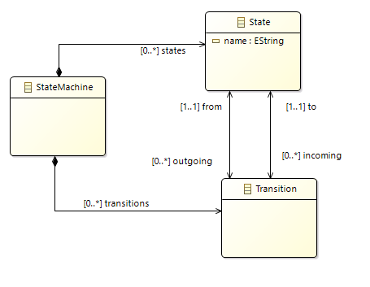
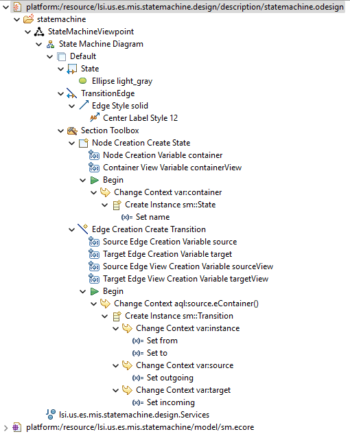
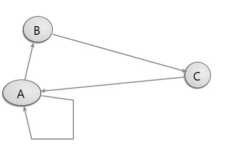
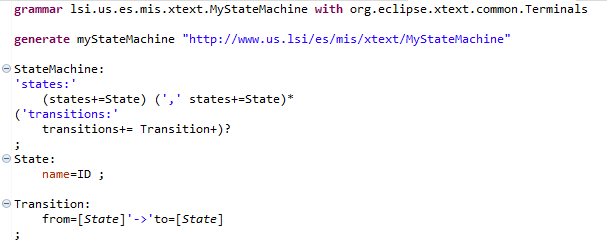
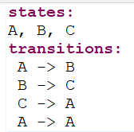

# Statemachine sample
Project with a metamodel definition, a graphical, a textual editor and model to text transformations.

## lsi.us.es.mis.statemachine 
Project that contains a simple statemachine metamodel. The root of the metamodel is the _StateMachine_ metaclass. A _statemachine_ is composed of _states_ and _transitions_, 
that are modelled by means of the _State_ and _Transition_ metaclasses, respectively. _States_ are related to other states by means of incoming and outgoing transitions.

## lsi.us.es.mis.statemachine.design
Project that contains the specification of the Sirius generated graphical editor. The specification of the editor is in the statemachine.odesign file. This is a DSL for specifying graphical editors in Sirius.

An example of instance of the graphical modelling language is:

## lsi.us.es.mis.xtext.statemachine.* 
Set of projects that contains the XText grammar and the model to text transformations. 
The grammar is quite simple. A _Statemachine_ has _states_ and _transitions_. _States_ are defined as a list of comma separated elements. While _transitions_ are a list of origin_state->target_state sentences.

An example of instance of the previous grammar is:

There are two model to text transformations defined:
* StateMachine to GraphViz
It generates a graphviz file to represent the statemachine as a graph.

* StateMachine to Java
It generates the java code to run the statemachine

## lsi.us.es.mis.statemachine.samples
Project with examples of instances of the textual language and the result of the model to text transformation for each instance. The src folder contains the grammar instances and the src-gen contains the generated stuff.
